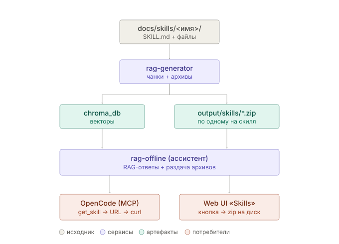

# Скиллы в базе знаний: архитектура

Проект фичи «скиллы» — часть базы знаний, которую можно не только обсуждать
словами, но и **скачать целиком** для установки в code-агент.



## Задача

Скилл — это не один `SKILL.md`, а целая папка: рядом лежат другие `.md`,
подпапки (`rules/`, `examples/`, `prompts/`), шаблоны (`report-template.html`),
скрипты. Отсюда два разных сценария потребления:

1. **Разговор** — человек в вебе или агент через MCP спрашивает «что умеет
   java-performance-review» и получает текстовый ответ из RAG.
2. **Установка** — OpenCode (или человек руками) забирает **весь каталог
   скилла архивом** и разворачивает у себя.

## Ключевое ограничение

Контейнер ассистента (`rag-offline`) монтирует только `chroma_db` — **исходных
файлов у него нет**, и в целевой схеме источником будет Bitbucket, а не
локальный диск. Поэтому архивы собирает **генератор** (у него есть исходники),
а ассистент их только раздаёт. Это же держит артефакты «производными и
пересобираемыми», как и вся векторная база, и не ломает blue-green подмену
папки `output/`.

Альтернатива «зипуем на лету в ассистенте» отвергнута: потребовала бы
монтировать в ассистент исходное дерево, которого в проде не будет.

## 1. Разметка источника

`rag-generation/config/rag-sources.yaml`:

```yaml
  - name: skills
    path: ./docs/skills
    type: skills            # каждая подпапка с SKILL.md = один скилл
    include: ["**/*.md"]    # что режется в чанки
    archive:
      exclude: ["**/.git/**", "**/.idea/**", "**/node_modules/**"]
      max_size_mb: 25
```

`type: docs` — значение по умолчанию, все существующие источники продолжают
работать без изменений.

## 2. Детекция скилла и метаданные

Папка считается скиллом, если **непосредственно** в ней лежит `SKILL.md`
(вложенные скиллы не ищем — нашли, дальше не спускаемся).

Метаданные читаем терпимо, в три шага — потому что реальные скиллы не всегда
следуют конвенции (проверено на `trollimo/java-performance-review-skill`: там
frontmatter'а нет вовсе, только заголовок и строка `Version: 1.0 MVP`):

1. YAML-frontmatter (`name`, `description`, `version`) — конвенция Claude Code;
2. фоллбэк: первый `# Заголовок` → title, первый абзац → description,
   regex `Version:\s*(.+)` → version;
3. `name` **всегда** равен имени папки (slug) — это первичный ключ, по нему
   идёт и URL, и путь установки.

## 3. Что попадает в RAG, а что в архив

Это две разные выборки, и их нельзя путать:

| | RAG (чанки) | Архив (zip) |
|---|---|---|
| Содержимое | только `.md` по `include` | **вся папка** минус `exclude` |
| Зачем | обсуждать скилл словами | установить скилл целиком |
| Пример | `SKILL.md`, `rules/*.md` | + `report-template.html`, `examples/` |

Чанки скилла получают доп. метаданные: `is_skill: true`, `skill_name`,
`skill_root`. Сам **текст чанков не трогаем** — то, что это устанавливаемый
скилл, ассистент дописывает в контекст на лету по метаданным. Иначе смена
формулировки требовала бы переиндексации всего корпуса.

Внутри zip пути **относительно корня скилла** (`SKILL.md` лежит в корне
архива, а не во вложенной папке) — это ровно то, что нужно для распаковки
в `~/.config/opencode/skills/<name>/`.

## 4. Артефакты генератора

```
rag-generation/output/
├── chroma_db/                     # как сейчас
├── manifest.json                  # как сейчас
└── skills/                        # НОВОЕ
    ├── index.json                 # каталог всех скиллов
    ├── java-performance-review.zip
    └── pr-checklist.zip
```

`index.json` на каждый скилл: `name`, `title`, `description`, `version`,
`files[]`, `size_bytes`, `sha256`, опциональный `install_hint`.

`sha256` считается **по содержимому файлов**, а не по самому zip: zip
недетерминирован из-за таймстампов. Это даёт и инкрементальность (не пережимать
неизменившееся — в духе существующего `manifest.json`), и агенту возможность
не перекачивать уже установленное.

## 5. Ассистент: монтирование и REST

```yaml
volumes:
  - ../rag-generation/output/skills:/data/skills:ro   # только чтение
environment:
  - RAG_SKILLS_PATH=/data/skills
  - PUBLIC_BASE_URL=http://localhost:8000
```

| Метод | Назначение |
|---|---|
| `GET /skills` | каталог из `index.json` (кеш, перечитка по mtime) |
| `GET /skills/{name}` | карточка: метаданные, дерево файлов, ссылка, инструкция |
| `GET /skills/{name}/archive` | сам zip, `Content-Disposition: attachment` |

**Безопасность:** имя валидируется по `^[a-z0-9][a-z0-9._-]{0,63}$` **и**
ищется в `index.json`; путь никогда не склеивается из пользовательского ввода.
Path traversal здесь — самый очевидный риск.

## 6. MCP: два инструмента

* `list_skills(filter="")` — каталог, чтобы агент увидел, что вообще есть.
* `get_skill(name)` — метаданные + `download_url` + `sha256` + шаги установки.

**Почему ссылка, а не сам архив.** MCP-инструменты возвращают текст;
единственный способ отдать zip — base64, что забьёт контекст агента мегабайтами
мусора. У OpenCode есть bash и файловые инструменты, поэтому он качает и
распаковывает сам, а MCP отдаёт ему инструкцию.

**Почему нужен `PUBLIC_BASE_URL`.** MCP-сервер живёт внутри контейнера, а агент
— на машине разработчика, поэтому `localhost:8000` в выдаваемой ссылке не
годится; нужен адрес, по которому ассистент виден снаружи.

Инструкция по установке хранится в `mcp-tools.yaml` (как
`reactions.contribute_hint`), потому что путь установки у разных агентов
отличается и будет меняться:

```bash
mkdir -p ~/.config/opencode/skills/<name>
curl -fsSL <download_url> -o /tmp/<name>.zip
unzip -o /tmp/<name>.zip -d ~/.config/opencode/skills/<name>
```

## 7. Web UI

* **Правая (презентационная) панель становится двухвкладочной**: «Вопрос-ответ»
  (текущий `AnswerPanel`) и «Skills» — не попап, а полноценная вкладка того же
  уровня. Переключатель вкладок — вверху панели, над содержимым.
* **Вкладка Skills** — «магазин скиллов»: карточки с описанием, составом
  архива, размером и кнопкой «Скачать».
* **Внизу блока ответа** (на вкладке «Вопрос-ответ») — если в ответе
  засветились чанки скилла, показываем строку кратких кликабельных имён
  (`📦 java-performance-review`), клик переключает на вкладку Skills и
  открывает карточку этого скилла.

Какие скиллы «затронуты» ответом, определяется **структурно** — по метаданным
`is_skill` у сматченных чанков, без дополнительного вызова LLM. `/chat`
возвращает новое поле `skills: [{name, title, download_url}]`.

## 8. Тестовые данные

Новая папка `rag-generation/docs/skills/`, три скилла разного профиля:

1. **`java-performance-review`** — забирается с `trollimo/java-performance-review-skill`
   (без `.git`, `.idea`). Тяжёлый случай: нет frontmatter, много `.md` в корне,
   подпапки, HTML-шаблон.
2. **`pr-checklist`** — минимальный: `SKILL.md` + `checklist.md`. Нижняя граница.
3. **`k8s-manifest-review`** — с frontmatter, `scripts/validate.sh` и
   `references/`. Проверяет, что не-`.md` файлы попадают в архив, но **не** в
   векторизацию.

Проверка: чанки в chroma → архивы в `output/skills` → скачивание через Web UI →
`get_skill` из OpenCode.

## Открытые вопросы

1. ~~Куда OpenCode ставит скиллы?~~ — `~/.config/opencode/skills/<name>/SKILL.md`.
2. **Скиллы в Bitbucket** — тот же репозиторий, что и доки, или отдельный?
   Влияет на будущий коннектор (п.1 бэклога в `CLAUDE.md`).
3. **Версионирование** — нужно ли агенту запрашивать конкретную версию скилла?
   Предложение: в v1 всегда отдаём последнюю.
